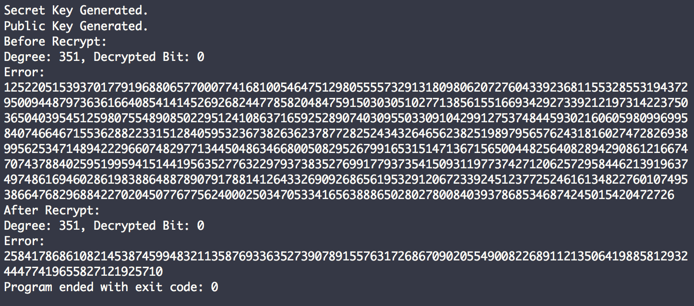

Fully Homomorphic C++ implementation of DGHV scheme using GNU MP library and Pari C library.
The repository also has implementations of improvements proposed by J.S. Coron et al.

I've used rand(), seeded with system time to generate random numbers, which is cryptographically insecure.
But, this is not an industrial grade implementation.

For the current parameters (not secure, for the sake of correctness of implementation), here's an example of recrypt (ignore the degree after recrypt, need to fix that):

